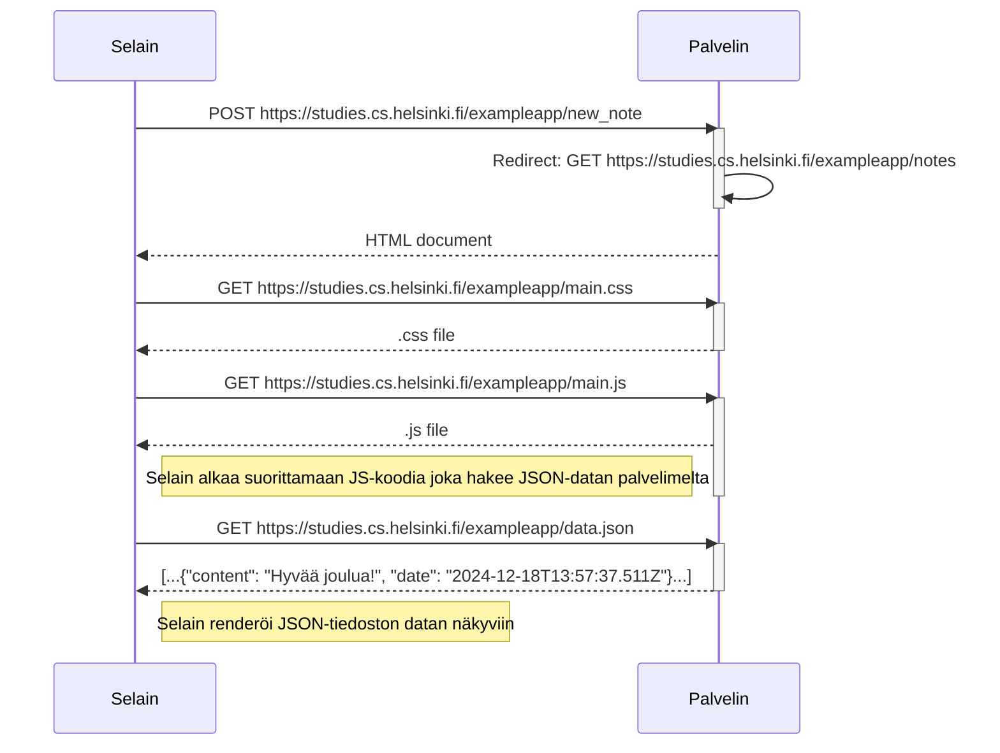

Full Stack Open - tehtävä 0.4: uusi muistiinpano

```mermaid
sequenceDiagram
participant Selain
participant Palvelin

Selain->>Palvelin: POST https://studies.cs.helsinki.fi/exampleapp/new_note
activate Palvelin
Palvelin->>Palvelin: Redirect: GET https://studies.cs.helsinki.fi/exampleapp/notes
deactivate Palvelin
Palvelin-->>Selain: HTML document
Selain->>Palvelin: GET https://studies.cs.helsinki.fi/exampleapp/main.css
activate Palvelin
Palvelin-->>Selain: .css file
deactivate Palvelin
Selain->>Palvelin: GET https://studies.cs.helsinki.fi/exampleapp/main.js
activate Palvelin
Palvelin-->>Selain: .js file
Note right of Selain: Selain alkaa suorittamaan JS-koodia joka hakee JSON-datan palvelimelta
deactivate Palvelin
Selain->>Palvelin: GET https://studies.cs.helsinki.fi/exampleapp/data.json
activate Palvelin
Palvelin-->>Selain: [...{"content": "Hyvää joulua!", "date": "2024-12-18T13:57:37.511Z"}...]
deactivate Palvelin
Note right of Selain: Selain renderöi JSON-tiedoston datan näkyviin
```
