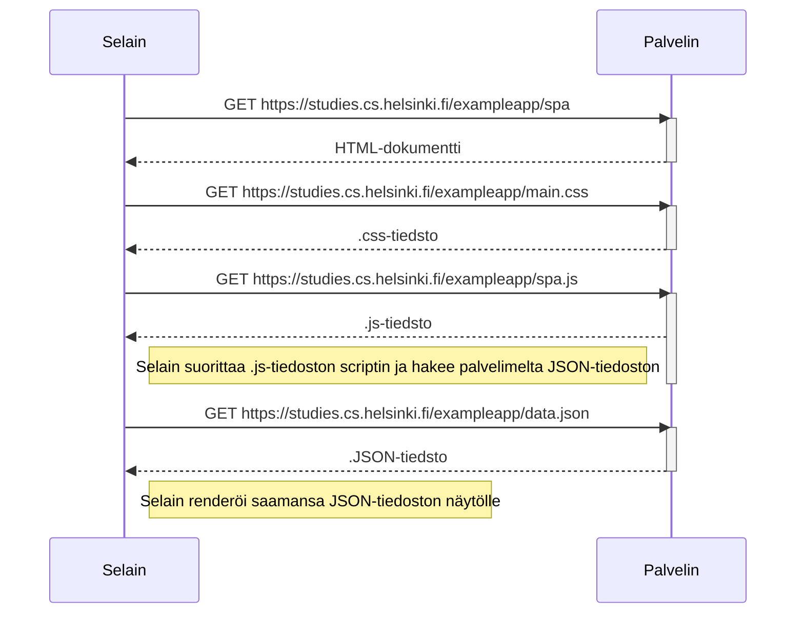

Full Stack Open - tehtävä 0.5: Single Page App

```mermaid
sequenceDiagram
participant Selain
participant Palvelin

Selain->>Palvelin: GET https://studies.cs.helsinki.fi/exampleapp/spa
activate Palvelin
Palvelin-->>Selain: HTML-dokumentti
deactivate Palvelin
Selain->>Palvelin: GET https://studies.cs.helsinki.fi/exampleapp/main.css
activate Palvelin
Palvelin-->>Selain: .css-tiedsto
deactivate Palvelin
Selain->>Palvelin: GET https://studies.cs.helsinki.fi/exampleapp/spa.js
activate Palvelin
Palvelin-->>Selain: .js-tiedsto
NOte right of Selain: Selain suorittaa .js-tiedoston scriptin ja hakee palvelimelta JSON-tiedoston
deactivate Palvelin
Selain->>Palvelin: GET https://studies.cs.helsinki.fi/exampleapp/data.json
activate Palvelin
Palvelin-->>Selain: .JSON-tiedsto
deactivate Palvelin
Note right of Selain: Selain renderöi saamansa JSON-tiedoston näytölle

```
