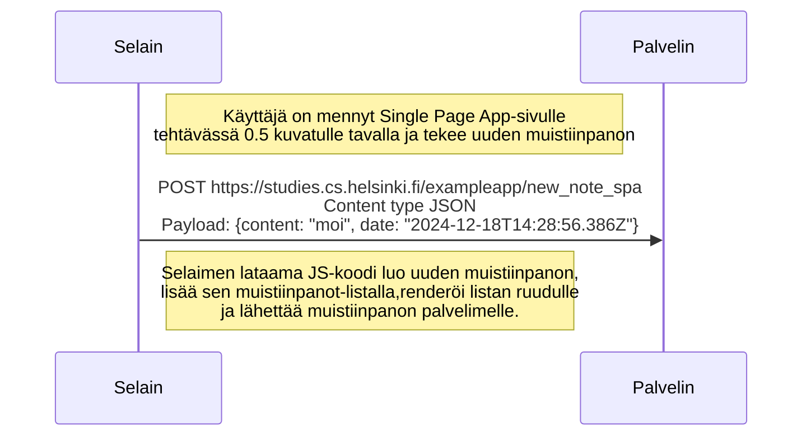

Full Stack Open - tehtävä 0.6: Uusi muistiinpano

```mermaid
sequenceDiagram
participant Selain
participant Palvelin
Note right of Selain: Käyttäjä on mennyt Single Page App-sivulle<br/> tehtävässä 0.5 kuvatulle tavalla ja tekee uuden muistiinpanon
Selain->>Palvelin: POST https://studies.cs.helsinki.fi/exampleapp/new_note_spa<BR/> Content type JSON<br/>Payload: {content: "moi", date: "2024-12-18T14:28:56.386Z"}
Note right of Selain: Selaimen lataama JS-koodi luo uuden muistiinpanon,<br/> lisää sen muistiinpanot-listalla,renderöi listan ruudulle<br/> ja lähettää muistiinpanon palvelimelle.


```
